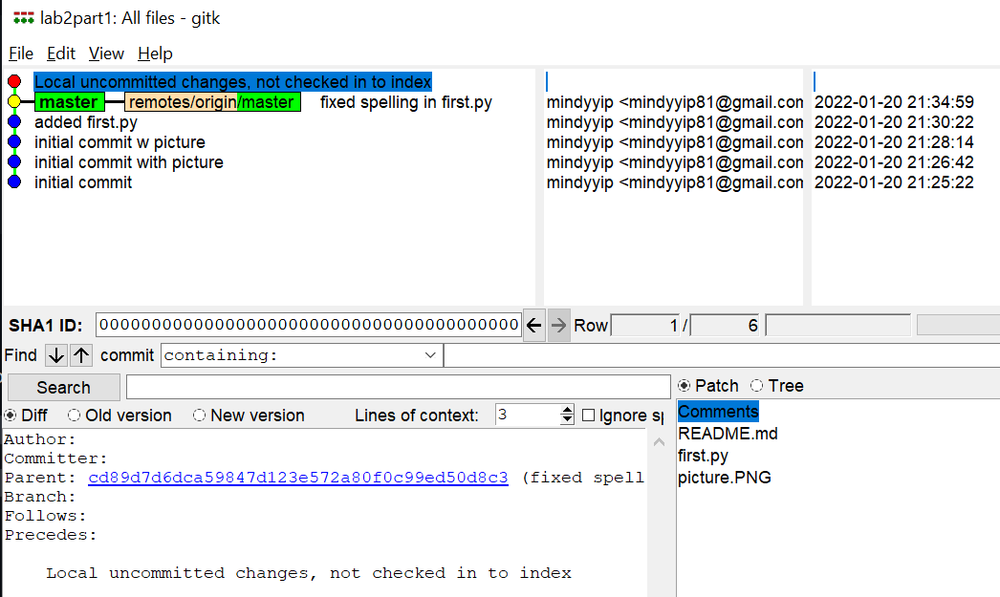
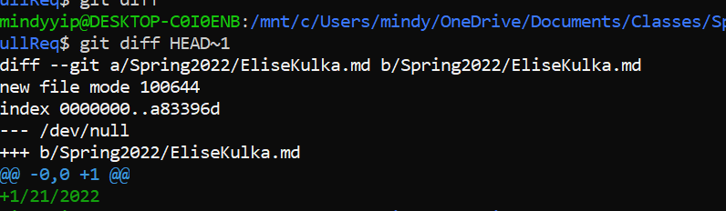

## Part 1

### Lab2Part1 REPO Link

[New Repo Link](https://github.com/mindyyip/lab2part1)

### gitk screenshot

### gitk all screenshot

### git-log screenshot

## Part 2

### Spoon-Knife Fork Link

[Spoon-Knife Repo](https://github.com/mindyyip/Spoon-Knife)

### Learn Git Branching

## Part 3

### Pull Req Link

[Pull Req Link](https://github.com/mindyyip/PullReq)

### git diff screenshot

### git tag -l screenshot

### Common Repository Table Repo 

[Common repo table link](https://github.com/BianoBonzo/OSSProjectIdeas)

